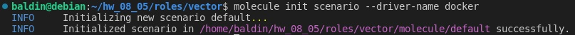

# Домашнее задание к занятию 5 «Тестирование roles»

## Подготовка к выполнению

1. Установите molecule: `pip3 install "molecule==3.5.2"` и драйвера `pip3 install molecule_docker molecule_podman`.
2. Выполните `docker pull aragast/netology:latest` —  это образ с podman, tox и несколькими пайтонами (3.7 и 3.9) внутри.

## Основная часть

Ваша цель — настроить тестирование ваших ролей. 

Задача — сделать сценарии тестирования для vector. 

Ожидаемый результат — все сценарии успешно проходят тестирование ролей.

### Molecule

1. Запустите  `molecule test -s centos_7` внутри корневой директории clickhouse-role, посмотрите на вывод команды. Данная команда может отработать с ошибками, это нормально. Наша цель - посмотреть как другие в реальном мире используют молекулу.
2. Перейдите в каталог с ролью vector-role и создайте сценарий тестирования по умолчанию при помощи `molecule init scenario --driver-name docker`.



3. Добавьте несколько разных дистрибутивов (centos:8, ubuntu:latest) для инстансов и протестируйте роль, исправьте найденные ошибки, если они есть.

**Дистрибутивы `centos:8` и `ubuntu:latest`**

```yaml
platforms:
  - name: centos:8
    image: docker.io/pycontribs/centos:8
    pre_build_image: true
  - name: ubuntu:latest
    image: docker.io/pycontribs/ubuntu:latest
    pre_build_image: true
```

</details>

<details><summary>molecule test</summary>

```console
baldin@debian:~/hw_08_05/08-ansible-04-role/roles/vector$ molecule test
INFO     default scenario test matrix: dependency, lint, cleanup, destroy, syntax, create, prepare, converge, idempotence, side_effect, verify, cleanup, destroy
INFO     Performing prerun...
INFO     Set ANSIBLE_LIBRARY=/home/baldin/.cache/ansible-compat/882b46/modules:/home/baldin/.ansible/plugins/modules:/usr/share/ansible/plugins/modules
INFO     Set ANSIBLE_COLLECTIONS_PATH=/home/baldin/.cache/ansible-compat/882b46/collections:/home/baldin/.ansible/collections:/usr/share/ansible/collections
INFO     Set ANSIBLE_ROLES_PATH=/home/baldin/.cache/ansible-compat/882b46/roles:/home/baldin/.ansible/roles:/usr/share/ansible/roles:/etc/ansible/roles
INFO     Running default > dependency
WARNING  Skipping, missing the requirements file.
WARNING  Skipping, missing the requirements file.
INFO     Running default > lint
INFO     Lint is disabled.
INFO     Running default > cleanup
WARNING  Skipping, cleanup playbook not configured.
INFO     Running default > destroy
INFO     Sanity checks: 'docker'
[DEPRECATION WARNING]: Ansible will require Python 3.8 or newer on the 
controller starting with Ansible 2.12. Current version: 3.7.3 (default, Oct 11 
2023, 09:51:27) [GCC 8.3.0]. This feature will be removed from ansible-core in 
version 2.12. Deprecation warnings can be disabled by setting 
deprecation_warnings=False in ansible.cfg.

PLAY [Destroy] *****************************************************************

TASK [Destroy molecule instance(s)] ********************************************
changed: [localhost] => (item=centos8)
changed: [localhost] => (item=ubuntu)

TASK [Wait for instance(s) deletion to complete] *******************************
ok: [localhost] => (item=centos8)
ok: [localhost] => (item=ubuntu)

TASK [Delete docker networks(s)] ***********************************************

PLAY RECAP *********************************************************************
localhost                  : ok=2    changed=1    unreachable=0    failed=0    skipped=1    rescued=0    ignored=0

INFO     Running default > syntax
[DEPRECATION WARNING]: Ansible will require Python 3.8 or newer on the 
controller starting with Ansible 2.12. Current version: 3.7.3 (default, Oct 11 
2023, 09:51:27) [GCC 8.3.0]. This feature will be removed from ansible-core in 
version 2.12. Deprecation warnings can be disabled by setting 
deprecation_warnings=False in ansible.cfg.

playbook: /home/baldin/hw_08_05/08-ansible-04-role/roles/vector/molecule/default/converge.yml
INFO     Running default > create
[DEPRECATION WARNING]: Ansible will require Python 3.8 or newer on the 
controller starting with Ansible 2.12. Current version: 3.7.3 (default, Oct 11 
2023, 09:51:27) [GCC 8.3.0]. This feature will be removed from ansible-core in 
version 2.12. Deprecation warnings can be disabled by setting 
deprecation_warnings=False in ansible.cfg.

PLAY [Create] ******************************************************************

TASK [Log into a Docker registry] **********************************************
skipping: [localhost] => (item=None) 
skipping: [localhost] => (item=None) 
skipping: [localhost]

TASK [Check presence of custom Dockerfiles] ************************************
ok: [localhost] => (item={'image': 'docker.io/pycontribs/centos:8', 'name': 'centos8', 'pre_build_image': True})
ok: [localhost] => (item={'image': 'docker.io/pycontribs/ubuntu:latest', 'name': 'ubuntu', 'pre_build_image': True})

TASK [Create Dockerfiles from image names] *************************************
skipping: [localhost] => (item={'image': 'docker.io/pycontribs/centos:8', 'name': 'centos8', 'pre_build_image': True}) 
skipping: [localhost] => (item={'image': 'docker.io/pycontribs/ubuntu:latest', 'name': 'ubuntu', 'pre_build_image': True}) 

TASK [Discover local Docker images] ********************************************
ok: [localhost] => (item={'changed': False, 'skipped': True, 'skip_reason': 'Conditional result was False', 'item': {'image': 'docker.io/pycontribs/centos:8', 'name': 'centos8', 'pre_build_image': True}, 'ansible_loop_var': 'item', 'i': 0, 'ansible_index_var': 'i'})
ok: [localhost] => (item={'changed': False, 'skipped': True, 'skip_reason': 'Conditional result was False', 'item': {'image': 'docker.io/pycontribs/ubuntu:latest', 'name': 'ubuntu', 'pre_build_image': True}, 'ansible_loop_var': 'item', 'i': 1, 'ansible_index_var': 'i'})

TASK [Build an Ansible compatible image (new)] *********************************
skipping: [localhost] => (item=molecule_local/docker.io/pycontribs/centos:8) 
skipping: [localhost] => (item=molecule_local/docker.io/pycontribs/ubuntu:latest) 

TASK [Create docker network(s)] ************************************************

TASK [Determine the CMD directives] ********************************************
ok: [localhost] => (item={'image': 'docker.io/pycontribs/centos:8', 'name': 'centos8', 'pre_build_image': True})
ok: [localhost] => (item={'image': 'docker.io/pycontribs/ubuntu:latest', 'name': 'ubuntu', 'pre_build_image': True})

TASK [Create molecule instance(s)] *********************************************
changed: [localhost] => (item=centos8)
changed: [localhost] => (item=ubuntu)

TASK [Wait for instance(s) creation to complete] *******************************
FAILED - RETRYING: Wait for instance(s) creation to complete (300 retries left).
changed: [localhost] => (item={'started': 1, 'finished': 0, 'ansible_job_id': '499431011507.144704', 'results_file': '/home/baldin/.ansible_async/499431011507.144704', 'changed': True, 'failed': False, 'item': {'image': 'docker.io/pycontribs/centos:8', 'name': 'centos8', 'pre_build_image': True}, 'ansible_loop_var': 'item'})
changed: [localhost] => (item={'started': 1, 'finished': 0, 'ansible_job_id': '369947400393.144732', 'results_file': '/home/baldin/.ansible_async/369947400393.144732', 'changed': True, 'failed': False, 'item': {'image': 'docker.io/pycontribs/ubuntu:latest', 'name': 'ubuntu', 'pre_build_image': True}, 'ansible_loop_var': 'item'})

PLAY RECAP *********************************************************************
localhost                  : ok=5    changed=2    unreachable=0    failed=0    skipped=4    rescued=0    ignored=0

INFO     Running default > prepare
WARNING  Skipping, prepare playbook not configured.
INFO     Running default > converge
[DEPRECATION WARNING]: Ansible will require Python 3.8 or newer on the 
controller starting with Ansible 2.12. Current version: 3.7.3 (default, Oct 11 
2023, 09:51:27) [GCC 8.3.0]. This feature will be removed from ansible-core in 
version 2.12. Deprecation warnings can be disabled by setting 
deprecation_warnings=False in ansible.cfg.

PLAY [Converge] ****************************************************************

TASK [Gathering Facts] *********************************************************
ok: [ubuntu]
ok: [centos8]

TASK [Include vector] **********************************************************

TASK [vector : Create directory vector] ****************************************
changed: [ubuntu]
changed: [centos8]

TASK [vector : Get vector distrib] *********************************************
changed: [ubuntu]
changed: [centos8]

TASK [vector : Unarchive vector] ***********************************************
changed: [ubuntu]
changed: [centos8]

TASK [vector : Create a symbolic link] *****************************************
changed: [centos8]
changed: [ubuntu]

TASK [vector : Create vector unit flie] ****************************************
changed: [centos8]
changed: [ubuntu]

TASK [vector : Mkdir vector data] **********************************************
changed: [centos8]
changed: [ubuntu]

TASK [vector : Vector config create] *******************************************
changed: [ubuntu]
changed: [centos8]

TASK [vector : Configuring service vector] *************************************
skipping: [centos8]
skipping: [ubuntu]

PLAY RECAP *********************************************************************
centos8                    : ok=8    changed=7    unreachable=0    failed=0    skipped=1    rescued=0    ignored=0
ubuntu                     : ok=8    changed=7    unreachable=0    failed=0    skipped=1    rescued=0    ignored=0

INFO     Running default > idempotence
[DEPRECATION WARNING]: Ansible will require Python 3.8 or newer on the 
controller starting with Ansible 2.12. Current version: 3.7.3 (default, Oct 11 
2023, 09:51:27) [GCC 8.3.0]. This feature will be removed from ansible-core in 
version 2.12. Deprecation warnings can be disabled by setting 
deprecation_warnings=False in ansible.cfg.

PLAY [Converge] ****************************************************************

TASK [Gathering Facts] *********************************************************
ok: [centos8]
ok: [ubuntu]

TASK [Include vector] **********************************************************

TASK [vector : Create directory vector] ****************************************
ok: [centos8]
ok: [ubuntu]

TASK [vector : Get vector distrib] *********************************************
ok: [ubuntu]
ok: [centos8]

TASK [vector : Unarchive vector] ***********************************************
skipping: [centos8]
skipping: [ubuntu]

TASK [vector : Create a symbolic link] *****************************************
ok: [centos8]
ok: [ubuntu]

TASK [vector : Create vector unit flie] ****************************************
ok: [ubuntu]
ok: [centos8]

TASK [vector : Mkdir vector data] **********************************************
ok: [ubuntu]
ok: [centos8]

TASK [vector : Vector config create] *******************************************
ok: [ubuntu]
ok: [centos8]

TASK [vector : Configuring service vector] *************************************
skipping: [centos8]
skipping: [ubuntu]

PLAY RECAP *********************************************************************
centos8                    : ok=7    changed=0    unreachable=0    failed=0    skipped=2    rescued=0    ignored=0
ubuntu                     : ok=7    changed=0    unreachable=0    failed=0    skipped=2    rescued=0    ignored=0

INFO     Idempotence completed successfully.
INFO     Running default > side_effect
WARNING  Skipping, side effect playbook not configured.
INFO     Running default > verify
INFO     Running Ansible Verifier
[DEPRECATION WARNING]: Ansible will require Python 3.8 or newer on the 
controller starting with Ansible 2.12. Current version: 3.7.3 (default, Oct 11 
2023, 09:51:27) [GCC 8.3.0]. This feature will be removed from ansible-core in 
version 2.12. Deprecation warnings can be disabled by setting 
deprecation_warnings=False in ansible.cfg.

PLAY [Verify] ******************************************************************

TASK [Example assertion] *******************************************************
ok: [ubuntu] => {
    "changed": false,
    "msg": "All assertions passed"
}
ok: [centos8] => {
    "changed": false,
    "msg": "All assertions passed"
}

PLAY RECAP *********************************************************************
centos8                    : ok=1    changed=0    unreachable=0    failed=0    skipped=0    rescued=0    ignored=0
ubuntu                     : ok=1    changed=0    unreachable=0    failed=0    skipped=0    rescued=0    ignored=0

INFO     Verifier completed successfully.
INFO     Running default > cleanup
WARNING  Skipping, cleanup playbook not configured.
INFO     Running default > destroy
[DEPRECATION WARNING]: Ansible will require Python 3.8 or newer on the 
controller starting with Ansible 2.12. Current version: 3.7.3 (default, Oct 11 
2023, 09:51:27) [GCC 8.3.0]. This feature will be removed from ansible-core in 
version 2.12. Deprecation warnings can be disabled by setting 
deprecation_warnings=False in ansible.cfg.

PLAY [Destroy] *****************************************************************

TASK [Destroy molecule instance(s)] ********************************************
changed: [localhost] => (item=centos8)
changed: [localhost] => (item=ubuntu)

TASK [Wait for instance(s) deletion to complete] *******************************
FAILED - RETRYING: Wait for instance(s) deletion to complete (300 retries left).
FAILED - RETRYING: Wait for instance(s) deletion to complete (299 retries left).
changed: [localhost] => (item=centos8)
changed: [localhost] => (item=ubuntu)

TASK [Delete docker networks(s)] ***********************************************

PLAY RECAP *********************************************************************
localhost                  : ok=2    changed=2    unreachable=0    failed=0    skipped=1    rescued=0    ignored=0

INFO     Pruning extra files from scenario ephemeral directory
```
</details>

4. Добавьте несколько assert в verify.yml-файл для  проверки работоспособности vector-role (проверка, что конфиг валидный, проверка успешности запуска и др.). 

</details>

<details><summary>Дополненный Verify</summary>

```yaml
- name: Verify
  hosts: all
  gather_facts: false
  vars_files:
    -  "{{ lookup('ansible.builtin.env', 'MOLECULE_PROJECT_DIRECTORY') }}/vars/main.yml"
  tasks:

  - name: Get Vector version
    ansible.builtin.command: "vector --version"
    changed_when: false
    register: vector_version
  - name: Assert Vector instalation
    assert:
      that: "'{{ vector_version.rc }}' == '0'"

  - name: Validation Vector configuration
    ansible.builtin.command: "vector validate --no-environment --config-toml {{ vector_config }}"
    changed_when: false
    register: vector_validate
  - name: Assert Vector validate config
    assert:
      that: "'{{ vector_validate.rc }}' == '0'"
```
</details>

5. Запустите тестирование роли повторно и проверьте, что оно прошло успешно.

</details>

<details><summary>Повторил тест</summary>

baldin@debian:~/hw_08_05/08-ansible-04-role/roles/vector$ molecule test
INFO     default scenario test matrix: dependency, lint, cleanup, destroy, syntax, create, prepare, converge, idempotence, side_effect, verify, cleanup, destroy
INFO     Performing prerun...
INFO     Set ANSIBLE_LIBRARY=/home/baldin/.cache/ansible-compat/882b46/modules:/home/baldin/.ansible/plugins/modules:/usr/share/ansible/plugins/modules
INFO     Set ANSIBLE_COLLECTIONS_PATH=/home/baldin/.cache/ansible-compat/882b46/collections:/home/baldin/.ansible/collections:/usr/share/ansible/collections
INFO     Set ANSIBLE_ROLES_PATH=/home/baldin/.cache/ansible-compat/882b46/roles:/home/baldin/.ansible/roles:/usr/share/ansible/roles:/etc/ansible/roles
INFO     Running default > dependency
WARNING  Skipping, missing the requirements file.
WARNING  Skipping, missing the requirements file.
INFO     Running default > lint
INFO     Lint is disabled.
INFO     Running default > cleanup
WARNING  Skipping, cleanup playbook not configured.
INFO     Running default > destroy
INFO     Sanity checks: 'docker'
[DEPRECATION WARNING]: Ansible will require Python 3.8 or newer on the 
controller starting with Ansible 2.12. Current version: 3.7.3 (default, Oct 11 
2023, 09:51:27) [GCC 8.3.0]. This feature will be removed from ansible-core in 
version 2.12. Deprecation warnings can be disabled by setting 
deprecation_warnings=False in ansible.cfg.

PLAY [Destroy] *****************************************************************

TASK [Destroy molecule instance(s)] ********************************************
changed: [localhost] => (item=centos8)
changed: [localhost] => (item=ubuntu)

TASK [Wait for instance(s) deletion to complete] *******************************
ok: [localhost] => (item=centos8)
ok: [localhost] => (item=ubuntu)

TASK [Delete docker networks(s)] ***********************************************

PLAY RECAP *********************************************************************
localhost                  : ok=2    changed=1    unreachable=0    failed=0    skipped=1    rescued=0    ignored=0

INFO     Running default > syntax
[DEPRECATION WARNING]: Ansible will require Python 3.8 or newer on the 
controller starting with Ansible 2.12. Current version: 3.7.3 (default, Oct 11 
2023, 09:51:27) [GCC 8.3.0]. This feature will be removed from ansible-core in 
version 2.12. Deprecation warnings can be disabled by setting 
deprecation_warnings=False in ansible.cfg.

playbook: /home/baldin/hw_08_05/08-ansible-04-role/roles/vector/molecule/default/converge.yml
INFO     Running default > create
[DEPRECATION WARNING]: Ansible will require Python 3.8 or newer on the 
controller starting with Ansible 2.12. Current version: 3.7.3 (default, Oct 11 
2023, 09:51:27) [GCC 8.3.0]. This feature will be removed from ansible-core in 
version 2.12. Deprecation warnings can be disabled by setting 
deprecation_warnings=False in ansible.cfg.

PLAY [Create] ******************************************************************

TASK [Log into a Docker registry] **********************************************
skipping: [localhost] => (item=None) 
skipping: [localhost] => (item=None) 
skipping: [localhost]

TASK [Check presence of custom Dockerfiles] ************************************
ok: [localhost] => (item={'image': 'docker.io/pycontribs/centos:8', 'name': 'centos8', 'pre_build_image': True})
ok: [localhost] => (item={'image': 'docker.io/pycontribs/ubuntu:latest', 'name': 'ubuntu', 'pre_build_image': True})

TASK [Create Dockerfiles from image names] *************************************
skipping: [localhost] => (item={'image': 'docker.io/pycontribs/centos:8', 'name': 'centos8', 'pre_build_image': True}) 
skipping: [localhost] => (item={'image': 'docker.io/pycontribs/ubuntu:latest', 'name': 'ubuntu', 'pre_build_image': True}) 

TASK [Discover local Docker images] ********************************************
ok: [localhost] => (item={'changed': False, 'skipped': True, 'skip_reason': 'Conditional result was False', 'item': {'image': 'docker.io/pycontribs/centos:8', 'name': 'centos8', 'pre_build_image': True}, 'ansible_loop_var': 'item', 'i': 0, 'ansible_index_var': 'i'})
ok: [localhost] => (item={'changed': False, 'skipped': True, 'skip_reason': 'Conditional result was False', 'item': {'image': 'docker.io/pycontribs/ubuntu:latest', 'name': 'ubuntu', 'pre_build_image': True}, 'ansible_loop_var': 'item', 'i': 1, 'ansible_index_var': 'i'})

TASK [Build an Ansible compatible image (new)] *********************************
skipping: [localhost] => (item=molecule_local/docker.io/pycontribs/centos:8) 
skipping: [localhost] => (item=molecule_local/docker.io/pycontribs/ubuntu:latest) 

TASK [Create docker network(s)] ************************************************

TASK [Determine the CMD directives] ********************************************
ok: [localhost] => (item={'image': 'docker.io/pycontribs/centos:8', 'name': 'centos8', 'pre_build_image': True})
ok: [localhost] => (item={'image': 'docker.io/pycontribs/ubuntu:latest', 'name': 'ubuntu', 'pre_build_image': True})

TASK [Create molecule instance(s)] *********************************************
changed: [localhost] => (item=centos8)
changed: [localhost] => (item=ubuntu)

TASK [Wait for instance(s) creation to complete] *******************************
changed: [localhost] => (item={'started': 1, 'finished': 0, 'ansible_job_id': '285112306589.217797', 'results_file': '/home/baldin/.ansible_async/285112306589.217797', 'changed': True, 'failed': False, 'item': {'image': 'docker.io/pycontribs/centos:8', 'name': 'centos8', 'pre_build_image': True}, 'ansible_loop_var': 'item'})
changed: [localhost] => (item={'started': 1, 'finished': 0, 'ansible_job_id': '479806471625.217825', 'results_file': '/home/baldin/.ansible_async/479806471625.217825', 'changed': True, 'failed': False, 'item': {'image': 'docker.io/pycontribs/ubuntu:latest', 'name': 'ubuntu', 'pre_build_image': True}, 'ansible_loop_var': 'item'})

PLAY RECAP *********************************************************************
localhost                  : ok=5    changed=2    unreachable=0    failed=0    skipped=4    rescued=0    ignored=0

INFO     Running default > prepare
WARNING  Skipping, prepare playbook not configured.
INFO     Running default > converge
[DEPRECATION WARNING]: Ansible will require Python 3.8 or newer on the 
controller starting with Ansible 2.12. Current version: 3.7.3 (default, Oct 11 
2023, 09:51:27) [GCC 8.3.0]. This feature will be removed from ansible-core in 
version 2.12. Deprecation warnings can be disabled by setting 
deprecation_warnings=False in ansible.cfg.

PLAY [Converge] ****************************************************************

TASK [Gathering Facts] *********************************************************
ok: [ubuntu]
ok: [centos8]

TASK [Include vector] **********************************************************

TASK [vector : Create directory vector] ****************************************
changed: [ubuntu]
changed: [centos8]

TASK [vector : Get vector distrib] *********************************************
changed: [ubuntu]
changed: [centos8]

TASK [vector : Unarchive vector] ***********************************************
changed: [ubuntu]
changed: [centos8]

TASK [vector : Create a symbolic link] *****************************************
changed: [ubuntu]
changed: [centos8]

TASK [vector : Create vector unit flie] ****************************************
changed: [ubuntu]
changed: [centos8]

TASK [vector : Mkdir vector data] **********************************************
changed: [centos8]
changed: [ubuntu]

TASK [vector : Vector config create] *******************************************
changed: [centos8]
changed: [ubuntu]

TASK [vector : Configuring service vector] *************************************
skipping: [centos8]
skipping: [ubuntu]

PLAY RECAP *********************************************************************
centos8                    : ok=8    changed=7    unreachable=0    failed=0    skipped=1    rescued=0    ignored=0
ubuntu                     : ok=8    changed=7    unreachable=0    failed=0    skipped=1    rescued=0    ignored=0

INFO     Running default > idempotence
[DEPRECATION WARNING]: Ansible will require Python 3.8 or newer on the 
controller starting with Ansible 2.12. Current version: 3.7.3 (default, Oct 11 
2023, 09:51:27) [GCC 8.3.0]. This feature will be removed from ansible-core in 
version 2.12. Deprecation warnings can be disabled by setting 
deprecation_warnings=False in ansible.cfg.

PLAY [Converge] ****************************************************************

TASK [Gathering Facts] *********************************************************
ok: [centos8]
ok: [ubuntu]

TASK [Include vector] **********************************************************

TASK [vector : Create directory vector] ****************************************
ok: [ubuntu]
ok: [centos8]

TASK [vector : Get vector distrib] *********************************************
ok: [ubuntu]
ok: [centos8]

TASK [vector : Unarchive vector] ***********************************************
skipping: [centos8]
skipping: [ubuntu]

TASK [vector : Create a symbolic link] *****************************************
ok: [ubuntu]
ok: [centos8]

TASK [vector : Create vector unit flie] ****************************************
ok: [ubuntu]
ok: [centos8]

TASK [vector : Mkdir vector data] **********************************************
ok: [centos8]
ok: [ubuntu]

TASK [vector : Vector config create] *******************************************
ok: [centos8]
ok: [ubuntu]

TASK [vector : Configuring service vector] *************************************
skipping: [centos8]
skipping: [ubuntu]

PLAY RECAP *********************************************************************
centos8                    : ok=7    changed=0    unreachable=0    failed=0    skipped=2    rescued=0    ignored=0
ubuntu                     : ok=7    changed=0    unreachable=0    failed=0    skipped=2    rescued=0    ignored=0

INFO     Idempotence completed successfully.
INFO     Running default > side_effect
WARNING  Skipping, side effect playbook not configured.
INFO     Running default > verify
INFO     Running Ansible Verifier
[DEPRECATION WARNING]: Ansible will require Python 3.8 or newer on the 
controller starting with Ansible 2.12. Current version: 3.7.3 (default, Oct 11 
2023, 09:51:27) [GCC 8.3.0]. This feature will be removed from ansible-core in 
version 2.12. Deprecation warnings can be disabled by setting 
deprecation_warnings=False in ansible.cfg.

PLAY [Verify] ******************************************************************

TASK [Get Vector version] ******************************************************
ok: [ubuntu]
ok: [centos8]

TASK [Assert Vector instalation] ***********************************************
ok: [centos8] => {
    "changed": false,
    "msg": "All assertions passed"
}
ok: [ubuntu] => {
    "changed": false,
    "msg": "All assertions passed"
}

TASK [Validation Vector configuration] *****************************************
ok: [centos8]
ok: [ubuntu]

TASK [Assert Vector validate config] *******************************************
ok: [centos8] => {
    "changed": false,
    "msg": "All assertions passed"
}
ok: [ubuntu] => {
    "changed": false,
    "msg": "All assertions passed"
}

PLAY RECAP *********************************************************************
centos8                    : ok=4    changed=0    unreachable=0    failed=0    skipped=0    rescued=0    ignored=0
ubuntu                     : ok=4    changed=0    unreachable=0    failed=0    skipped=0    rescued=0    ignored=0

INFO     Verifier completed successfully.
INFO     Running default > cleanup
WARNING  Skipping, cleanup playbook not configured.
INFO     Running default > destroy
[DEPRECATION WARNING]: Ansible will require Python 3.8 or newer on the 
controller starting with Ansible 2.12. Current version: 3.7.3 (default, Oct 11 
2023, 09:51:27) [GCC 8.3.0]. This feature will be removed from ansible-core in 
version 2.12. Deprecation warnings can be disabled by setting 
deprecation_warnings=False in ansible.cfg.

PLAY [Destroy] *****************************************************************

TASK [Destroy molecule instance(s)] ********************************************
changed: [localhost] => (item=centos8)
changed: [localhost] => (item=ubuntu)

TASK [Wait for instance(s) deletion to complete] *******************************
FAILED - RETRYING: Wait for instance(s) deletion to complete (300 retries left).
changed: [localhost] => (item=centos8)
changed: [localhost] => (item=ubuntu)

TASK [Delete docker networks(s)] ***********************************************

PLAY RECAP *********************************************************************
localhost                  : ok=2    changed=2    unreachable=0    failed=0    skipped=1    rescued=0    ignored=0

INFO     Pruning extra files from scenario ephemeral directory

</details>

6. Добавьте новый тег на коммит с рабочим сценарием в соответствии с семантическим версионированием.

[v.1.0.1](https://github.com/baldin-lex/vector_role/releases/tag/v1.0.1)

### Tox

1. Добавьте в директорию с vector-role файлы из [директории](./example).
2. Запустите `docker run --privileged=True -v <path_to_repo>:/opt/vector-role -w /opt/vector-role -it aragast/netology:latest /bin/bash`, где path_to_repo — путь до корня репозитория с vector-role на вашей файловой системе.
3. Внутри контейнера выполните команду `tox`, посмотрите на вывод.

</details>

<details><summary>Вывод</summary>

aldin@debian:~/hw_08_05/08-ansible-04-role/roles/vector$ docker run --privileged=True -v /home/baldin/hw_08_05/08-ansible-04-role/roles/vector:/opt/vector -w /opt/vector -it aragast/netology:latest /bin/bas
h
[root@48ce8a07f545 vector]# tox
py37-ansible210 installed: ansible==2.10.7,ansible-base==2.10.17,ansible-compat==1.0.0,ansible-lint==5.1.3,arrow==1.2.3,bcrypt==4.0.1,binaryornot==0.4.4,bracex==2.3.post1,cached-property==1.5.2,Cerberus==1.3.5,certifi==2023.7.22,cffi==1.15.1,chardet==5.2.0,charset-normalizer==3.3.2,click==8.1.7,click-help-colors==0.9.2,cookiecutter==2.4.0,cryptography==41.0.5,distro==1.8.0,enrich==1.2.7,idna==3.4,importlib-metadata==6.7.0,Jinja2==3.1.2,jmespath==1.0.1,lxml==4.9.3,markdown-it-py==2.2.0,MarkupSafe==2.1.3,mdurl==0.1.2,molecule==3.5.2,molecule-podman==1.1.0,packaging==23.2,paramiko==2.12.0,pathspec==0.11.2,pluggy==1.2.0,pycparser==2.21,Pygments==2.16.1,PyNaCl==1.5.0,python-dateutil==2.8.2,python-slugify==8.0.1,PyYAML==5.4.1,requests==2.31.0,rich==13.6.0,ruamel.yaml==0.18.5,ruamel.yaml.clib==0.2.8,selinux==0.2.1,six==1.16.0,subprocess-tee==0.3.5,tenacity==8.2.3,text-unidecode==1.3,typing_extensions==4.7.1,urllib3==2.0.7,wcmatch==8.4.1,yamllint==1.26.3,zipp==3.15.0
py37-ansible210 run-test-pre: PYTHONHASHSEED='835614274'
py37-ansible210 run-test: commands[0] | molecule test -s compatibility --destroy always
ERROR: InvocationError for command /opt/vector/.tox/py37-ansible210/bin/molecule test -s compatibility --destroy always (exited with code 2)
py37-ansible30 installed: ansible==3.0.0,ansible-base==2.10.17,ansible-compat==1.0.0,ansible-lint==5.1.3,arrow==1.2.3,bcrypt==4.0.1,binaryornot==0.4.4,bracex==2.3.post1,cached-property==1.5.2,Cerberus==1.3.5,certifi==2023.7.22,cffi==1.15.1,chardet==5.2.0,charset-normalizer==3.3.2,click==8.1.7,click-help-colors==0.9.2,cookiecutter==2.4.0,cryptography==41.0.5,distro==1.8.0,enrich==1.2.7,idna==3.4,importlib-metadata==6.7.0,Jinja2==3.1.2,jmespath==1.0.1,lxml==4.9.3,markdown-it-py==2.2.0,MarkupSafe==2.1.3,mdurl==0.1.2,molecule==3.5.2,molecule-podman==1.1.0,packaging==23.2,paramiko==2.12.0,pathspec==0.11.2,pluggy==1.2.0,pycparser==2.21,Pygments==2.16.1,PyNaCl==1.5.0,python-dateutil==2.8.2,python-slugify==8.0.1,PyYAML==5.4.1,requests==2.31.0,rich==13.6.0,ruamel.yaml==0.18.5,ruamel.yaml.clib==0.2.8,selinux==0.2.1,six==1.16.0,subprocess-tee==0.3.5,tenacity==8.2.3,text-unidecode==1.3,typing_extensions==4.7.1,urllib3==2.0.7,wcmatch==8.4.1,yamllint==1.26.3,zipp==3.15.0
py37-ansible30 run-test-pre: PYTHONHASHSEED='835614274'
py37-ansible30 run-test: commands[0] | molecule test -s compatibility --destroy always
ERROR: InvocationError for command /opt/vector/.tox/py37-ansible30/bin/molecule test -s compatibility --destroy always (exited with code 2)
py39-ansible210 create: /opt/vector/.tox/py39-ansible210
py39-ansible210 installdeps: -rtox-requirements.txt, ansible<3.0
^CERROR: got KeyboardInterrupt signal
___________________________________________________________________________________________________ summary ___________________________________________________________________________________________________
ERROR:   py37-ansible210: commands failed
ERROR:   py37-ansible30: commands failed
ERROR:   py39-ansible210: keyboardinterrupt
ERROR:   py39-ansible30: undefined

</details>

4. Создайте облегчённый сценарий для `molecule` с драйвером `molecule_podman`. Проверьте его на исполнимость.

```yaml

scenario:
  test_sequence:
  - destroy
  - create
  - converge
  - destroy

```

5. Пропишите правильную команду в `tox.ini`, чтобы запускался облегчённый сценарий.

```yaml

commands =
    {posargs:molecule test -s podman --destroy always}

```

6. Запустите команду `tox`. Убедитесь, что всё отработало успешно.

</details>

<details><summary>Ошибка при выполнении таски [get podman executable path]</summary>

```console

TASK [get podman executable path] **********************************************
task path: /home/baldin/.local/lib/python3.7/site-packages/molecule_podman/playbooks/create.yml:11
File lookup using /home/baldin/.cache/molecule/vector/podman/molecule.yml as file
<127.0.0.1> ESTABLISH LOCAL CONNECTION FOR USER: baldin
<127.0.0.1> EXEC /bin/sh -c 'echo ~baldin && sleep 0'
<127.0.0.1> EXEC /bin/sh -c '( umask 77 && mkdir -p "` echo /home/baldin/.ansible/tmp `"&& mkdir "` echo /home/baldin/.ansible/tmp/ansible-tmp-1699647517.28208-258454-7988385037713 `" && echo ansible-tmp-1699647517.28208-258454-7988385037713="` echo /home/baldin/.ansible/tmp/ansible-tmp-1699647517.28208-258454-7988385037713 `" ) && sleep 0'
Including module_utils file ansible/__init__.py
Including module_utils file ansible/module_utils/__init__.py
Including module_utils file ansible/module_utils/_text.py
Including module_utils file ansible/module_utils/basic.py
Including module_utils file ansible/module_utils/common/_collections_compat.py
Including module_utils file ansible/module_utils/common/__init__.py
Including module_utils file ansible/module_utils/common/_json_compat.py
Including module_utils file ansible/module_utils/common/_utils.py
Including module_utils file ansible/module_utils/common/arg_spec.py
Including module_utils file ansible/module_utils/common/collections.py
Including module_utils file ansible/module_utils/common/file.py
Including module_utils file ansible/module_utils/common/parameters.py
Including module_utils file ansible/module_utils/common/process.py
Including module_utils file ansible/module_utils/common/sys_info.py
Including module_utils file ansible/module_utils/common/text/converters.py
Including module_utils file ansible/module_utils/common/text/__init__.py
Including module_utils file ansible/module_utils/common/text/formatters.py
Including module_utils file ansible/module_utils/common/validation.py
Including module_utils file ansible/module_utils/common/warnings.py
Including module_utils file ansible/module_utils/compat/selectors.py
Including module_utils file ansible/module_utils/compat/__init__.py
Including module_utils file ansible/module_utils/compat/_selectors2.py
Including module_utils file ansible/module_utils/compat/selinux.py
Including module_utils file ansible/module_utils/distro/__init__.py
Including module_utils file ansible/module_utils/distro/_distro.py
Including module_utils file ansible/module_utils/errors.py
Including module_utils file ansible/module_utils/parsing/convert_bool.py
Including module_utils file ansible/module_utils/parsing/__init__.py
Including module_utils file ansible/module_utils/pycompat24.py
Including module_utils file ansible/module_utils/six/__init__.py
Using module file /home/baldin/.local/lib/python3.7/site-packages/ansible/modules/command.py
<127.0.0.1> PUT /home/baldin/.ansible/tmp/ansible-local-258440au46afb9/tmptyvjgkx3 TO /home/baldin/.ansible/tmp/ansible-tmp-1699647517.28208-258454-7988385037713/AnsiballZ_command.py
<127.0.0.1> EXEC /bin/sh -c 'chmod u+x /home/baldin/.ansible/tmp/ansible-tmp-1699647517.28208-258454-7988385037713/ /home/baldin/.ansible/tmp/ansible-tmp-1699647517.28208-258454-7988385037713/AnsiballZ_command.py && sleep 0'
<127.0.0.1> EXEC /bin/sh -c '/usr/bin/python3 /home/baldin/.ansible/tmp/ansible-tmp-1699647517.28208-258454-7988385037713/AnsiballZ_command.py && sleep 0'
<127.0.0.1> EXEC /bin/sh -c 'rm -f -r /home/baldin/.ansible/tmp/ansible-tmp-1699647517.28208-258454-7988385037713/ > /dev/null 2>&1 && sleep 0'
fatal: [localhost]: FAILED! => {
    "changed": false,
    "cmd": [
        "which",
        "podman"
    ],
    "delta": "0:00:00.004364",
    "end": "2023-11-10 23:18:38.068947",
    "invocation": {
        "module_args": {
            "_raw_params": "which podman",
            "_uses_shell": false,
            "argv": null,
            "chdir": null,
            "creates": null,
            "executable": null,
            "removes": null,
            "stdin": null,
            "stdin_add_newline": true,
            "strip_empty_ends": true,
            "warn": false
        }
    },
    "msg": "non-zero return code",
    "rc": 1,
    "start": "2023-11-10 23:18:38.064583",
    "stderr": "",
    "stderr_lines": [],
    "stdout": "",
    "stdout_lines": []
}

PLAY RECAP *********************************************************************
localhost                  : ok=0    changed=0    unreachable=0    failed=1    skipped=0    rescued=0    ignored=0

```

</details>

7. Добавьте новый тег на коммит с рабочим сценарием в соответствии с семантическим версионированием.

[v.1.0.2](https://github.com/baldin-lex/vector_role/releases/tag/v1.0.2)

После выполнения у вас должно получится два сценария molecule и один tox.ini файл в репозитории. Не забудьте указать в ответе теги решений Tox и Molecule заданий. В качестве решения пришлите ссылку на  ваш репозиторий и скриншоты этапов выполнения задания. 

## Необязательная часть

1. Проделайте схожие манипуляции для создания роли LightHouse.
2. Создайте сценарий внутри любой из своих ролей, который умеет поднимать весь стек при помощи всех ролей.
3. Убедитесь в работоспособности своего стека. Создайте отдельный verify.yml, который будет проверять работоспособность интеграции всех инструментов между ними.
4. Выложите свои roles в репозитории.

В качестве решения пришлите ссылки и скриншоты этапов выполнения задания.

---

### Как оформить решение задания

Выполненное домашнее задание пришлите в виде ссылки на .md-файл в вашем репозитории.
